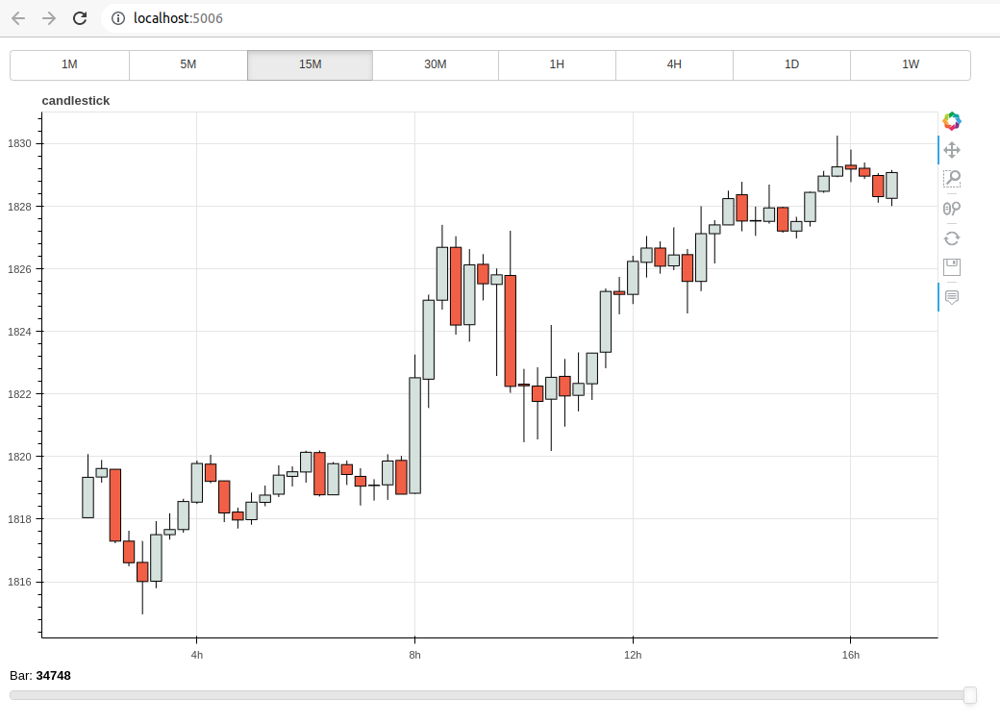
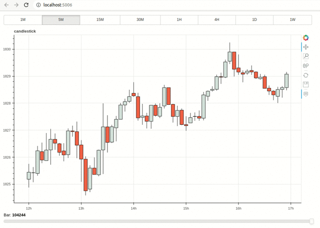

# StockViewerInteractable

## Project Introduction

* **Project based on [Bokeh](https://github.com/bokeh/bokeh)**
* This project is done on [candlestick-chart-with-slider
](https://github.com/zvapa/candlestick-chart-with-slider) based projects

## Project Notification

## Requirements

### Usage:
Required dependencies:
* `bokeh`
* `pandas`

Run: 
* `python main.py` to open in browser
